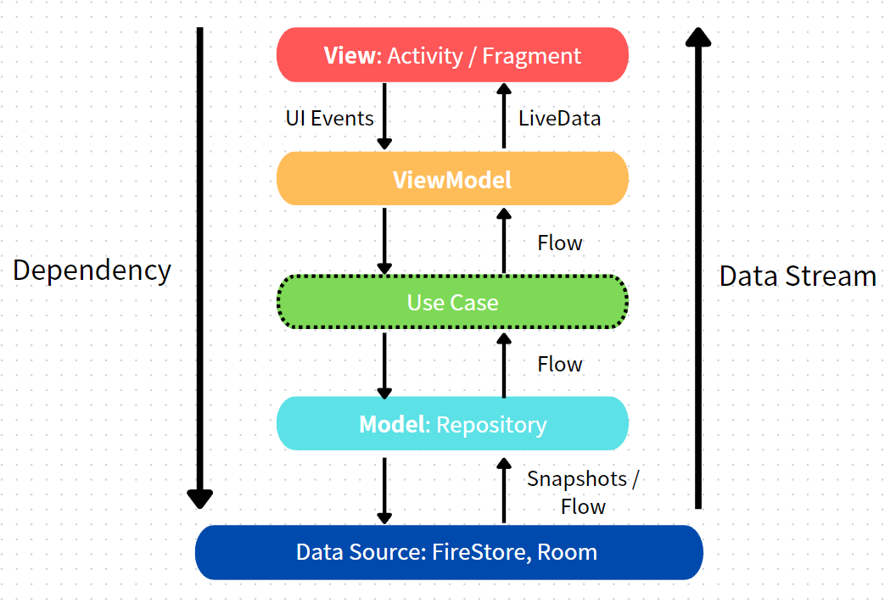

#  JO Board Game

 

 
 

 
- An app developed for board game enthusiasts, allowing you to host board game parties, browse board game information, and utilize board game tools
  
- Develop with **Kotlin**, adhere to **MVVM** architecture, utilize **Jetpack** toolkit, integrate **Firestore** cloud database, and cooperate with **Coroutine & Flow** for asynchronous programming
  
 
  

## Screenshots
      

## Demo
  

## Features
* **Host a Party** - Find companions to play with and arrange the games to play before the meetup
* **Board Game Browsing** - Quickly browse through board game information to avoid confusion during gameplay
* **Tabletop Tools** - Handy tools for your use, including dice, timers, spin the bottle, lottery drawing, and a lie detector
* **Meetup Map** - Locate meetups near you on a map
* **Meetup Album** - Document the wonderful moments with photos
* **Board Game Ratings** - Rate and refer to board game scores, making the selection process during meetups less confusing
* **Collect Board** Games - Save your favorite games for quick access when hosting a meetup
* **Search Feature** - Directly search for meetups, games, users, or find meetups related to the games you wish to play
* **Friendship Feature** - View the preferences and information of other users and befriend them
* **Report Feature** - Report any user that makes you feel uncomfortable; we will promptly review and take necessary actions

 
## Tech Stacks
* Implement MVVM Architecture to decouple logic, UI, and data layers, enhancing maintainability
* Design data structures and integrate Firestore for consistent cloud data synchronization across devices
* Utilize SnapshotListener to monitor real-time cloud data, ensuring synchronization of local updates such as comments and meetup information
* Implement **dependency injection** and **singleton** pattern with **Koin**
* Store user browsing data locally using Room Database for efficient offline viewing
* Adopt a custom RecyclerView for the Album interface, achieving a Waterfall effect, and integrate ViewPager for swipe-based photo navigation
* Integrate Google Maps SDK, mark the party location on the map, implement GPS positioning, and customize the InfoWindow
* Harness G-Sensor capabilities in the Lie Detector Mechanism to analyze XYZ axes acceleration and gauge subject anxiety levels
* Utilize **animation**, **Lottie library**, **Jetpack Compose**, **Canvas** and **G-Sensor**, to develop lively board game tools

      

## Architectures

